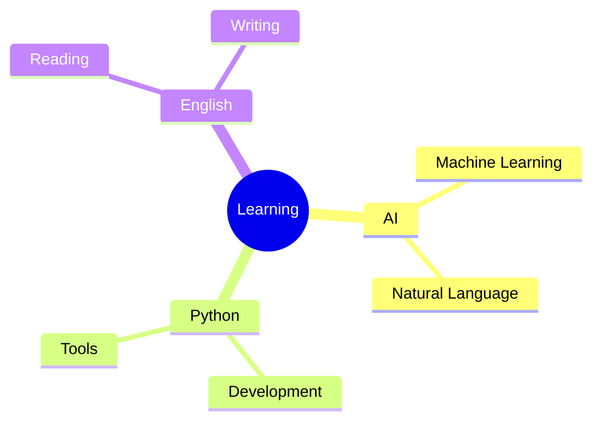

<div align="center">
 


</div>

<div align="center">
  
# 🌿 Welcome to My Digital Garden 🌿

[](https://git.io/typing-svg)

</div>

## ⋆⋆ About Me ⋆⋆


```python
class Developer:
    def __init__(self):
        self.name = "JoLiu-ai"
        self.role = "AI & Python Developer"
        self.learning = ["AI", "Python", "English"]
        self.interests = ["Technology", "Learning", "Tools"]
```

## 🌲 Tech Forest 🌲
<div align="center">

[](https://www.python.org/)
[](https://github.com/JoLiu-ai/AI-Learning)
[](https://jupyter.org/)
[](https://developer.mozilla.org/en-US/docs/Web/HTML)

</div>

## 🌿 Growing Projects 🌿

| Project | Description |
|---------|------------|
| [🤖 AI-Learning](https://github.com/JoLiu-ai/AI-Learning) | Exploring AI with English |
| [📚 English-Learning-journey](https://github.com/JoLiu-ai/English-Learning-journey) | My English learning path |
| [🐍 python-learning](https://github.com/JoLiu-ai/python-learning) | Python programming journey |
| [🔧 tools-in-life](https://github.com/JoLiu-ai/tools-in-life) | Useful tools collection |

## 📊 GitHub Analytics 

<div align="center">


</div>

## 🌱 Current Focus

<div align="center">



</div>

## ⭐ Connect With Me

[](https://github.com/JoLiu-ai)
[](https://github.com/JoLiu-ai)

---

> *"The best time to plant a tree was 20 years ago.  
> The second best time is now."*  
>
> 🌱 

---

<div align="center">
 


</div>
